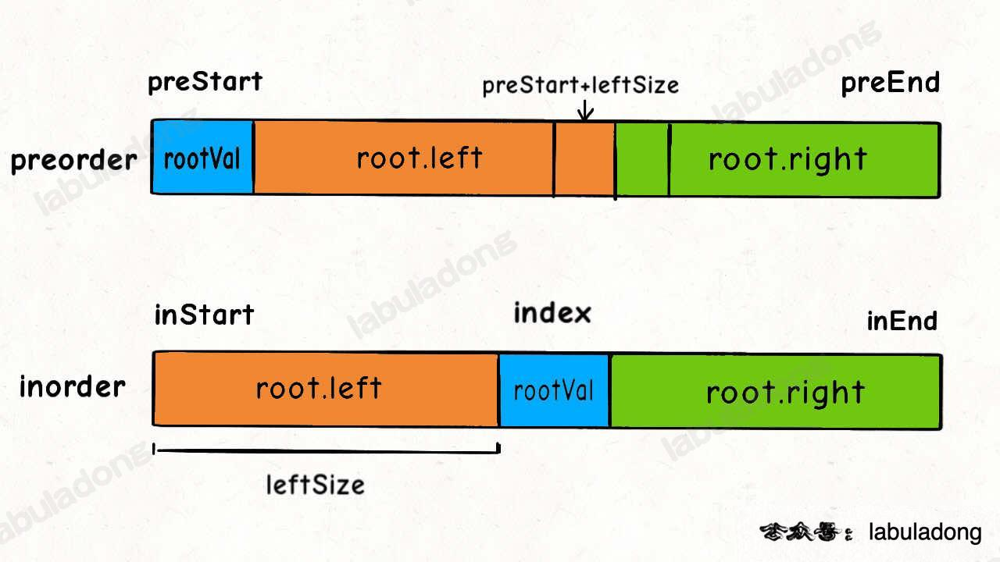

<!--
 * @Auther: zth
 * @Date: 2024-03-04 10:51:47
 * @LastEditTime: 2024-03-09 20:21:23
 * @Description:
-->

> Problem: [105. 从前序与中序遍历序列构造二叉树](https://leetcode.cn/problems/construct-binary-tree-from-preorder-and-inorder-traversal/)

> 参考博客：

# 标签

- 算法：#二叉树#
- 数据结构：

# 思路

这题属于「分解问题」思路，关键在于明确递归函数的定义：`build` 函数的作用是根据前序遍历数组 `preorder` 和中序遍历数组 `inorder` 构造二叉树，那么只要我先要找到根节点，然后让 build 函数递归生成左右子树即可。

# 解题方法

1. `preorder` 的第一个元素就是根节点的值，我们可以找到这个值在 `inorder` 中的位置（在找这个值的位置时，可以使用遍历，但是效率不高，可以使用哈希表存储 `inorder` 中的值和索引的映射关系）；
2. `inorder` 中根节点的位置将中序遍历数组分成了左右两个子树，我们可以得到左右子树的长度；
3. 有了左右子树的长度，我们就可以知道前序遍历数组中左右子树的起始索引和结束索引。



# 复杂度

- 时间复杂度：$O(N)$，其中 N 是二叉树的节点个数。
- 空间复杂度：$O(N)$，存储哈希表的空间。

# 代码

## labuladong

```Java
class Solution {

    // 通过哈希表存储中序遍历数组的值和索引的映射关系
    HashMap<Integer, Integer> valToIndex = new HashMap<>();

    public TreeNode buildTree(int[] preorder, int[] inorder) {

        // 构造哈希表
        for (int i = 0; i < inorder.length; i++) {
            valToIndex.put(inorder[i], i);
        }

        // 调用 build 函数
        return build(preorder, 0, preorder.length - 1, inorder, 0, inorder.length - 1);
    }

    TreeNode build(int[] preorder, int preStart, int preEnd, int inorder[], int inStart, int inEnd) {
        // base case：
        // 如果前序遍历数组为空，直接返回 null
        // 如果中序遍历数组为空，也直接返回 null
        // 其实二者是等价的，可以写一个条件就行，这里我写了两个
        if (preStart > preEnd || inStart > inEnd) {
            return null;
        }

        int rootVal = preorder[preStart]; // 根节点的值：前序遍历数组的第一个元素
        int index = valToIndex.get(rootVal); // 根节点在中序遍历数组中的索引
        int leftSize = index - inStart; // 左子树的长度

        // 构造根节点
        TreeNode root = new TreeNode(rootVal);

        // 递归构造左右子树
        root.left = build(preorder, preStart + 1, preStart + leftSize, inorder, inStart, index - 1);
        root.right = build(preorder, preStart + leftSize + 1, preEnd, inorder, index + 1, inEnd);

        return root;

    }
}
```
