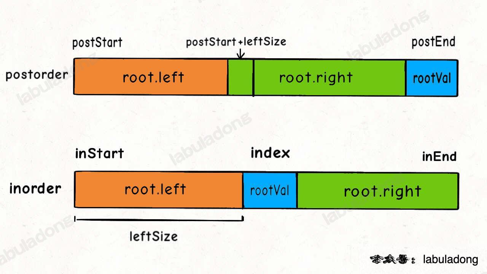

<!--
 * @Auther: zth
 * @Date: 2024-03-04 10:51:47
 * @LastEditTime: 2024-03-09 19:38:14
 * @Description:
-->

> Problem: [106. 从中序与后序遍历序列构造二叉树](https://leetcode.cn/problems/construct-binary-tree-from-inorder-and-postorder-traversal/)

> 参考博客：

# 标签

- 算法：
- 数据结构：

# 思路

和 [105. 从前序与中序遍历序列构造二叉树](105_从前序与中序遍历序列构造二叉树.md) 类似，这题属于「分解问题」思路，关键在于明确递归函数的定义：`build` 函数的作用是根据中序遍历数组 `inorder` 和后序遍历数组 `postorder` 构造二叉树，那么只要我先要找到根节点，然后让 build 函数递归生成左右子树即可。

# 解题方法



# 复杂度

- 时间复杂度：$O(N)$
- 空间复杂度：$O(N)$

# 代码

## labuladong

一开始我这样写报错 `StackOverflowError`：

```Java
root.left = build(inorder, inStart, index - 1, postorder, postStart, postStart + leftSize);
root.right = build(inorder, index + 1, inEnd, postorder, postStart + leftSize + 1, postEnd);
```

```Java
class Solution {

    HashMap<Integer, Integer> valToIndex = new HashMap<>();

    public TreeNode buildTree(int[] inorder, int[] postorder) {
        for (int i = 0; i < inorder.length; i++) {
            valToIndex.put(inorder[i], i);
        }
        return build(inorder, 0, inorder.length - 1, postorder, 0, postorder.length - 1);
    }

    TreeNode build(int[] inorder, int inStart, int inEnd, int[] postorder, int postStart, int postEnd) {
        if (inStart > inEnd) {
            return null;
        }

        int rootVal = postorder[postEnd];
        int index = valToIndex.get(rootVal);
        int leftSize = index - inStart;

        TreeNode root = new TreeNode(rootVal);
        root.left = build(inorder, inStart, index - 1, postorder, postStart, postStart + leftSize - 1);
        root.right = build(inorder, index + 1, inEnd, postorder, postStart + leftSize, postEnd - 1);

        return root;
    }
}
```
