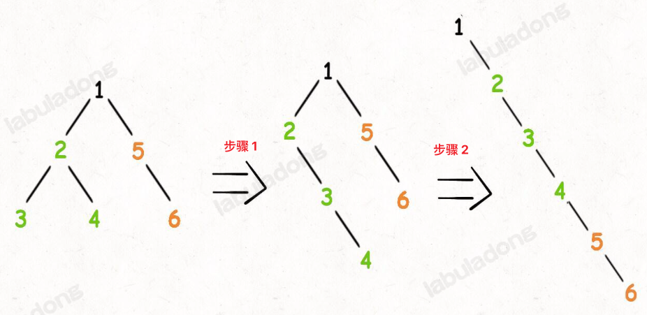

<!--
 * @Auther: zth
 * @Date: 2024-03-04 10:51:47
 * @LastEditTime: 2024-03-08 23:09:17
 * @Description:
-->

> Problem: [114. 二叉树展开为链表](https://leetcode.cn/problems/flatten-binary-tree-to-linked-list/)

> 参考博客：

# 标签

- 算法：#二叉树# #递归
- 数据结构：#二叉树

# 思路

这题用「分解问题」的思维，关键在于明确递归函数的定义：`flatten(root)` 函数的作用是将以 `root` 为根的二叉树拉平为链表。

# 解题方法

把以 `root` 为根的二叉树拉平为一条链表的流程：

1. 将 `root` 的左子树和右子树拉平；
2. 将 `root` 的右子树接到左子树的下方，然后将整个左子树作为右子树。



# 复杂度

- 时间复杂度：$O(N)$
- 空间复杂度：$O(N)$，递归栈的深度为 $O(N

# 代码

## labuladong

```Java
class Solution {
    public void flatten(TreeNode root) {
        if (root == null) return;
        // 先递归拉平左右子树
        flatten(root.left);
        flatten(root.right);

        // 后序遍历位置
        // 1. 左右子树已经被拉平成一条链表
        TreeNode left = root.left;
        TreeNode right = root.right;

        // 2. 将左子树作为右子树
        root.left = null;
        root.right = left;

        // 遍历新的右子树，找到最后一个节点
        TreeNode p = root;
        while (p.right != null) {
            p = p.right;
        }
        // 3. 将原先的右子树接到当前右子树的末端
        p.right = right;
    }
}
```
