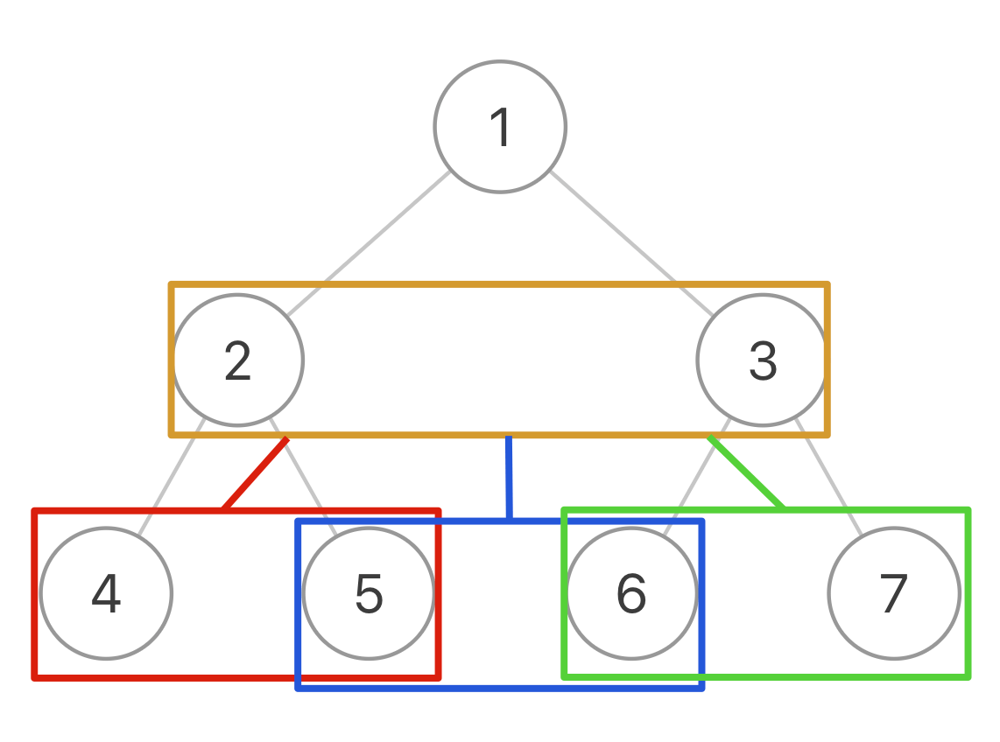

<!--
 * @Auther: zth
 * @Date: 2024-03-04 10:51:47
 * @LastEditTime: 2024-03-08 23:09:29
 * @Description:
-->

> Problem: [116. 填充每个节点的下一个右侧节点指针](https://leetcode.cn/problems/populating-next-right-pointers-in-each-node/)

> 参考博客：

# 标签

- 算法：#二叉树# #层次遍历
- 数据结构：#二叉树

# 思路

「遍历」可以，「分解问题」行不通。

# 解题方法

把二叉树的相邻节点抽象成一个「三叉树节点」，这样二叉树就变成了一棵「三叉树」，然后你去遍历这棵三叉树，把每个「三叉树节点」中的两个节点连接就行了：


# 复杂度

- 时间复杂度：$O(N)$
- 空间复杂度：$O(N)$，递归栈的深度为 $O(N)$

# 代码

## labuladong

经测试，`node1.next = node2;` 放在前、中、后序位置都可以，三个 `traversal` 的顺序也可以随意调换。

```Java
class Solution {
    public Node connect(Node root) {
        if (root == null) {
            return null;
        }

        // 遍历「三叉树」，连接相邻节点
        traversal(root.left, root.right);
        return root;
    }

    void traversal(Node node1, Node node2) {
        // 根据题目要求，这里左右节点肯定同时为空或者同时不为空，所以只判断一个也行
        if (node1 == null || node2 == null) {
            return;
        }

        // 前序位置：将传入的两个节点穿起啦
        node1.next = node2;

        // 连接相同父节点的两个子节点
        traversal(node1.left, node1.right);
        traversal(node2.left, node2.right);
        // 连接跨越父节点的两个子节点
        traversal(node1.right, node2.left);
    }
}
```
