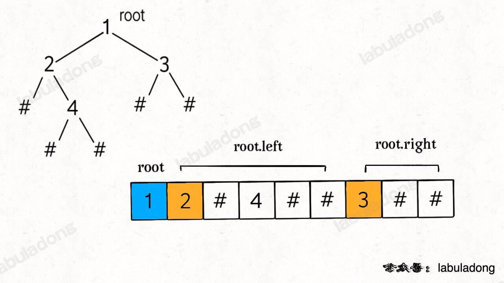
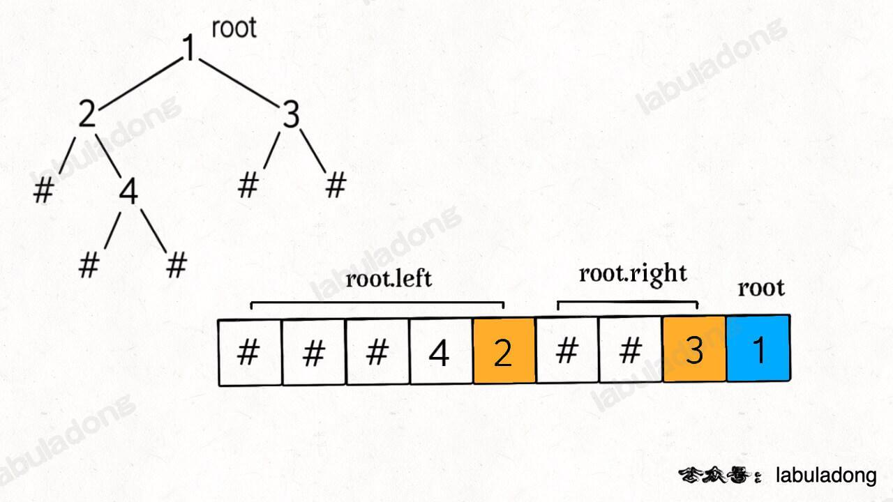

<!--
 * @Auther: zth
 * @Date: 2024-03-04 10:51:47
 * @LastEditTime: 2024-03-10 17:54:42
 * @Description:
-->

> Problem: [297. 二叉树的序列化与反序列化](https://leetcode.cn/problems/serialize-and-deserialize-binary-tree/)

> 参考博客：

# 标签

- 算法：#二叉树# #序列化# #反序列化
- 数据结构：#二叉树 #队列 #字符串

# 思路

1. ✅**前序遍历的思路**：

   - 序列化：在前序遍历位置将根节点值加入字符串；
   - 反序列化：前序遍历的特点是根节点在开头，然后接着左子树的前序遍历结果，然后接着右子树的前序遍历结果：
     

2. ✅**后序遍历的思路**：
   - 序列化：在后序遍历位置将根节点值加入字符串；
   - 反序列化：后序遍历的特点是根节点在最后，然后右子树的后序遍历结果，然后左子树的后序遍历结果：
     
3. ❌**中序遍历的思路**：
   - 序列化：可以；
   - 反序列化：不行，因为中序遍历的特点是 `root` 在中间，左子树在前，右子树在后，无法确定根节点的位置。
4. ✅**层序遍历的思路**：
   - 序列化：可以；
   - 反序列化：可以，但是需要使用队列。

# 解题方法

# 复杂度

- 时间复杂度：$O(N)$
- 空间复杂度：$O(N)$

# 代码

## labuladong

前序遍历：

```Java
public class Codec {

    String SEP = ",";
    String NULL = "#";

    // Encodes a tree to a single string.
    // 将二叉树转化为字符串
    public String serialize(TreeNode root) {
        StringBuilder sb = new StringBuilder();
        serialize(root, sb);
        return sb.toString();
    }

    // 辅助函数，将二叉树存入 StringBuilder
    void serialize(TreeNode root, StringBuilder sb) {
        if (root == null) {
            sb.append(NULL).append(SEP); // 将空指针用 # 表示
            return;
        }

        // 前序位置
        sb.append(root.val).append(SEP); // 将节点值存入 sb

        serialize(root.left, sb);
        serialize(root.right, sb);
    }

    // Decodes your encoded data to tree.
    public TreeNode deserialize(String data) {
        // 将字符串转化为列表
        LinkedList<String> nodes = new LinkedList<>();
        for (String s : data.split(SEP)) {
            nodes.addLast(s);
        }
        return deserialize(nodes);
    }

    TreeNode deserialize(LinkedList<String> nodes) {
        if (nodes.isEmpty()) {
            return null;
        }

        // 前序位置
        String first = nodes.removeFirst(); // 弹出首个元素
        if (first.equals(NULL)) { // 如果是 # ，说明是空指针
            return null; // 返回空节点，开始构建右子树
        }
        TreeNode root = new TreeNode(Integer.parseInt(first)); // 将字符串转化为整数

        root.left = deserialize(nodes);
        root.right = deserialize(nodes);

        return root;
    }
}
```

后序遍历：

```Java
public class Codec {

    String SEP = ",";
    String NULL = "#";

    // Encodes a tree to a single string.
    public String serialize(TreeNode root) {
        StringBuilder sb = new StringBuilder();
        serialize(root, sb);
        return sb.toString();
    }

    // 辅助函数，将二叉树存入 StringBuilder
    void serialize(TreeNode root, StringBuilder sb) {
        if (root == null) {
            sb.append(NULL).append(SEP);
            return;
        }

        serialize(root.left, sb);
        serialize(root.right, sb);

        // 后序位置
        sb.append(root.val).append(SEP);
    }

    // Decodes your encoded data to tree.
    public TreeNode deserialize(String data) {
        // 将字符串转化为列表
        LinkedList<String> nodes = new LinkedList<>();
        for (String s : data.split(SEP)) {
            nodes.addLast(s);
        }
        return deserialize(nodes);
    }

    TreeNode deserialize(LinkedList<String> nodes) {
        if (nodes.isEmpty()) {
            return null;
        }

        // 后序遍历序列化后的 root 节点在列表最后
        String last = nodes.removeLast();
        if (last.equals(NULL)) {
            return null;
        }
        TreeNode root = new TreeNode(Integer.parseInt(last));

        root.right = deserialize(nodes);
        root.left = deserialize(nodes);

        return root;
    }
}
```

层序遍历：

我写的代码将空二叉树的序列化结果为 "#,"，labuladong 的代码将空二叉树的序列化结果为 ""。

```Java
public class Codec {

    String SEP = ",";
    String NULL = "#";

    // Encodes a tree to a single string.
    public String serialize(TreeNode root) {
        StringBuilder sb = new StringBuilder();
        if (root == null) {
            sb.append(NULL).append(SEP);
            return sb.toString(); // 返回字符串 "#,"，表示空指针
        }

        Queue<TreeNode> q = new LinkedList<>();
        q.offer(root); // 将根节点加入队列
        while (!q.isEmpty()) {
            int sz = q.size(); // 记录当前层的节点个数
            for (int i = 0; i < sz; i ++) {
                TreeNode cur = q.poll(); // 取出队列的头节点
                if (cur == null) { // 如果头节点为空
                    sb.append(NULL).append(SEP);
                    continue;
                }

                // 如果头节点不为空
                sb.append(cur.val).append(SEP);
                q.offer(cur.left);
                q.offer(cur.right);
            }
        }

        return sb.toString();
    }

    // Decodes your encoded data to tree.
    public TreeNode deserialize(String data) {
        // 由于空二叉树的序列化结果为 "#,"，所以这条判断多余
        // if (data.isEmpty()) {
        //     return null;
        // }

        String[] nodes = data.split(SEP); // 将字符串转化为列表

        // 由于空二叉树的序列化结果为 "#,"，所以上面的判断挪到这里
        if (nodes[0].equals(NULL)) return null;
        TreeNode root = new TreeNode(Integer.parseInt(nodes[0])); // 将字符串转化为整数，得到根节点

        Queue<TreeNode> q = new LinkedList<>();
        q.offer(root); // 将根节点加入队列

        int index = 1; // index 变量记录正在序列化的节点在数组中的位置
        while (!q.isEmpty()) {
            int sz = q.size(); // 记录当前层的节点个数
            for (int i = 0; i < sz; i++) {
                TreeNode cur = q.poll(); // 取出队列的头节点

                // 构造左子节点
                String left = nodes[index++];
                if (!left.equals(NULL)) {
                    cur.left = new TreeNode(Integer.parseInt(left));
                    q.offer(cur.left);
                }

                // 构造右子节点
                String right = nodes[index++];
                if (!right.equals(NULL)) {
                    cur.right = new TreeNode(Integer.parseInt(right));
                    q.offer(cur.right);
                }
            }
        }
        return root;
    }
}
```

层序遍历：将空二叉树的序列化结果为 ""。

```Java
public class Codec {

    String SEP = ",";
    String NULL = "#";

    // Encodes a tree to a single string.
    public String serialize(TreeNode root) {
        StringBuilder sb = new StringBuilder();
        if (root == null) {
            return sb.toString();
        }

        Queue<TreeNode> q = new LinkedList<>();
        q.offer(root); // 将根节点加入队列
        while (!q.isEmpty()) {
            int sz = q.size(); // 记录当前层的节点个数
            for (int i = 0; i < sz; i ++) {
                TreeNode cur = q.poll(); // 取出队列的头节点
                if (cur == null) { // 如果头节点为空
                    sb.append(NULL).append(SEP);
                    continue;
                }

                // 如果头节点不为空
                sb.append(cur.val).append(SEP);
                q.offer(cur.left);
                q.offer(cur.right);
            }
        }

        return sb.toString();
    }

    // Decodes your encoded data to tree.
    public TreeNode deserialize(String data) {
        if (data.isEmpty()) {
            return null;
        }

        String[] nodes = data.split(SEP); // 将字符串转化为列表

        TreeNode root = new TreeNode(Integer.parseInt(nodes[0])); // 将字符串转化为整数，得到根节点

        Queue<TreeNode> q = new LinkedList<>();
        q.offer(root); // 将根节点加入队列

        int index = 1; // index 变量记录正在序列化的节点在数组中的位置
        while (!q.isEmpty()) {
            int sz = q.size(); // 记录当前层的节点个数
            for (int i = 0; i < sz; i++) {
                TreeNode cur = q.poll(); // 取出队列的头节点

                // 构造左子节点
                String left = nodes[index++];
                if (!left.equals(NULL)) {
                    cur.left = new TreeNode(Integer.parseInt(left));
                    q.offer(cur.left);
                }

                // 构造右子节点
                String right = nodes[index++];
                if (!right.equals(NULL)) {
                    cur.right = new TreeNode(Integer.parseInt(right));
                    q.offer(cur.right);
                }
            }
        }
        return root;
    }
}
```
