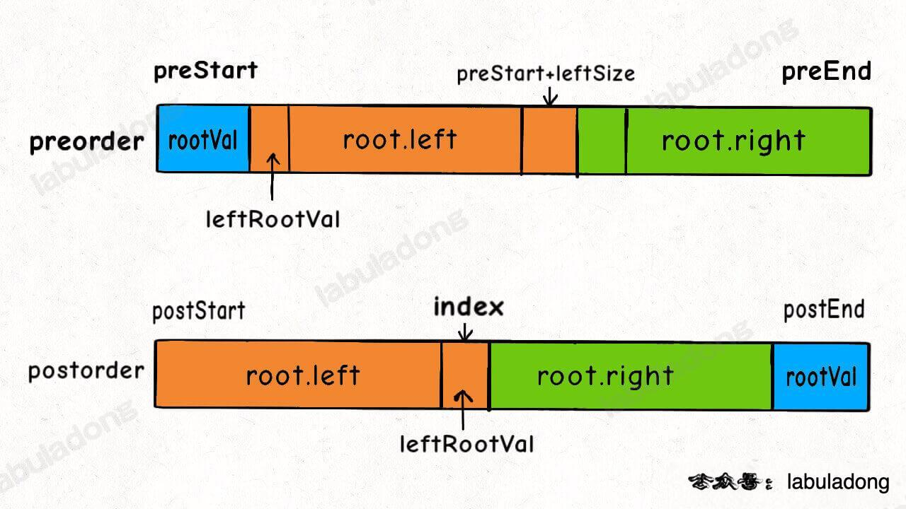

<!--
 * @Auther: zth
 * @Date: 2024-03-04 10:51:47
 * @LastEditTime: 2024-03-09 20:26:00
 * @Description:
-->

> Problem: [889. 根据前序和后序遍历构造二叉树](https://leetcode.cn/problems/construct-binary-tree-from-preorder-and-postorder-traversal/)

> 参考博客：

# 标签

- 算法：#二叉树# #递归
- 数据结构：#二叉树

# 思路

前两道题，可以通过前序或者后序遍历结果找到根节点，然后根据中序遍历结果确定左右子树。

这道题，你可以确定根节点，但是无法确切的知道左右子树有哪些节点。

举个例子，下面这两棵树结构不同，但是它们的前序遍历和后序遍历结果是相同的：

```plaintext
     1   1
    /     \
   2       2
  /         \
 3           3
```

# 解题方法

用后序遍历和前序遍历结果还原二叉树，解法逻辑上和前两道题差别不大，也是通过控制左右子树的索引来构建：

1. 首先把前序遍历结果的第一个元素或者后序遍历结果的最后一个元素确定为根节点的值。
2. 然后把前序遍历结果的第二个元素作为左子树的根节点的值。
3. 在后序遍历结果中寻找左子树根节点的值，从而确定了左子树的索引边界，进而确定右子树的索引边界，递归构造左右子树即可。



# 复杂度

- 时间复杂度：$O(N)$
- 空间复杂度：$O(N)$

# 代码

## labuladong

```Java
class Solution {

    HashMap<Integer, Integer> valueToIndex = new HashMap<>();

    public TreeNode constructFromPrePost(int[] preorder, int[] postorder) {

        for (int i = 0; i < postorder.length; i++) {
            valueToIndex.put(postorder[i], i);
        }
        return build(preorder, 0, preorder.length - 1, postorder, 0 ,postorder.length - 1);
    }

    TreeNode build(int[] preorder, int preStart, int preEnd, int[] postorder, int postStart, int postEnd) {
        // 递归终止条件
        if (preStart > preEnd) {
            return null;
        }

        // 如果只有一个节点，这里必须终止，因为后面的逻辑会出现数组越界
        if (preStart == preEnd) {
            return new TreeNode(preorder[preStart]);
        }

        int rootValue = preorder[preStart]; // 根节点的值
        int leftRootValue = preorder[preStart + 1]; // 左子树的根节点的值
        int index = valueToIndex.get(leftRootValue); // 左子树根节点在后序遍历结果中的索引
        int leftSize = index - postStart + 1; // 左子树的节点个数

        TreeNode root = new TreeNode(rootValue);

        root.left = build(preorder, preStart + 1, preStart + leftSize, postorder, postStart, index);
        root.right = build (preorder, preStart + leftSize + 1, preEnd, postorder, index + 1, postEnd - 1);

        return root;
    }
}
```

为什么通过前序遍历和后序遍历结果还原的二叉树可能不唯一呢？

关键在这一句：

```Java
int leftRootVal = preorder[preStart + 1];
```

我们假设前序遍历的第二个元素是左子树的根节点，但实际上左子树有可能是空指针，那么这个元素就应该是右子树的根节点。由于这里无法确切进行判断，所以导致了最终答案的不唯一。
