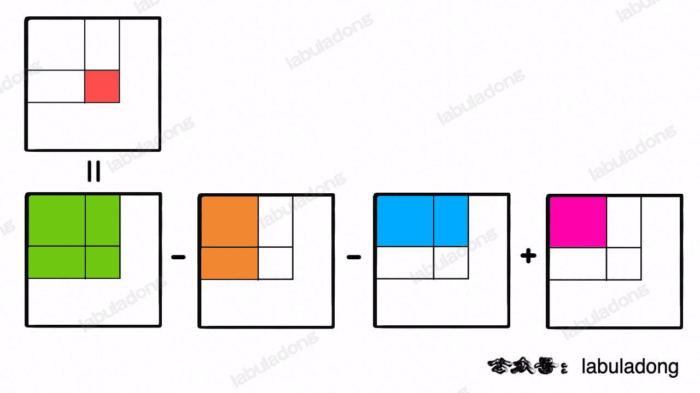
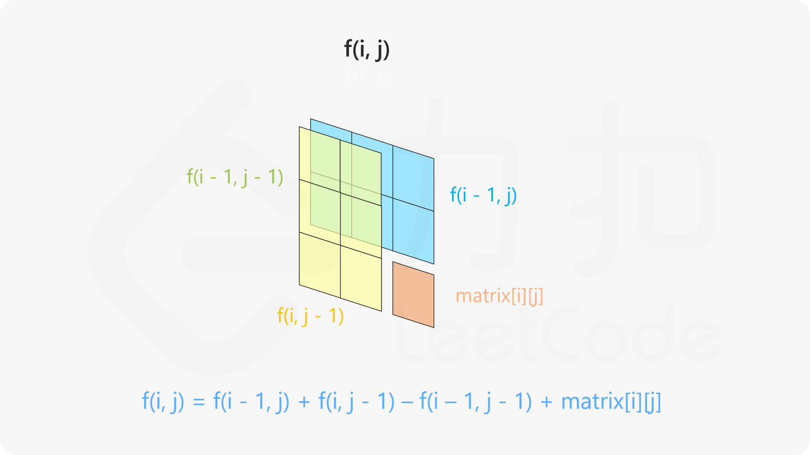
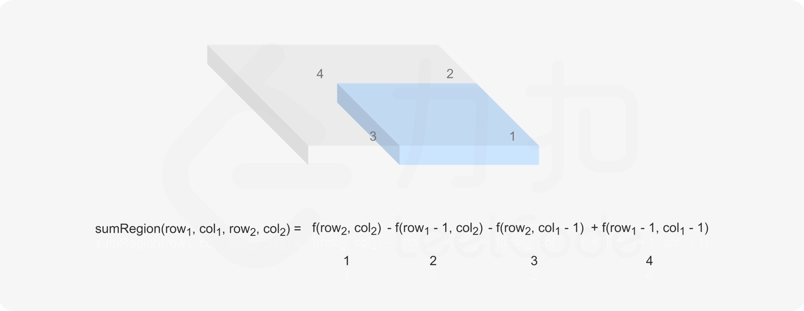

<!--
 * @Auther: zth
 * @Date: 2024-02-28 20:39:17
 * @LastEditTime: 2024-02-28 20:49:57
 * @Description: labuladong 小而美的算法技巧：前缀和数组
-->

> Problem: [304. 二维区域和检索 - 矩阵不可变](https://leetcode.cn/problems/range-sum-query-2d-immutable/description/)

# 标签

- 算法：#前缀和
- 数据结构：#数组 #矩阵

# 思路

- 嵌套 for 循环遍历矩阵时，函数 `sumRegion()` 的时间复杂度过高；
- 注意到任意子矩阵的元素和可以转化成它周边几个大矩阵的元素和的运算。
  

# 解题方法

1. 构造二维前缀和数组，记录以原点为顶点的矩阵的元素之和：
   `preSum[i][j] = preSum[i - 1][j] + preSum[i][j - 1] + matrix[i - 1][j - 1] - preSum[i - 1][j - 1];`
   

2. 计算任何一个子矩阵的元素和：
   `return preSum[row2 + 1][col2 + 1] - preSum[row1][col2 + 1] - preSum[row2 + 1][col1] + preSum[row1][col1];`
   

# 复杂度

- 时间复杂度：
  - 初始化 $O(mn)$
  - 每次检索 $O(1)$
- 空间复杂度：$O(mn)$。需要创建一个 $m + 1$ 行 $n + 1$ 列的二维前缀和数组 `preSum`。

# 代码

```Java
class NumMatrix {

    private int[][] preSum;

    public NumMatrix(int[][] matrix) {
        int m = matrix.length, n = matrix[0].length;
        if (m == 0 || n == 0) return;
        // 构造前缀和矩阵
        preSum = new int[m + 1][n + 1]; // 注意：默认初始化为全 0，第 0 行和第 0 列始终为 0
        for (int i = 1; i <= m; i++) {
            for (int j = 1; j <= n; j++) {
                // 计算每个矩阵 [0,0,i,j] 的元素和
                preSum[i][j] = preSum[i - 1][j] + preSum[i][j - 1] + matrix[i - 1][j - 1] - preSum[i - 1][j - 1];
            }
        }
    }

    // 计算子矩阵 [x1, y1, x2, y2] 的元素和
    public int sumRegion(int row1, int col1, int row2, int col2) {
        // 目标矩阵由四个相邻矩阵计算获得
        return preSum[row2 + 1][col2 + 1] - preSum[row1][col2 + 1] - preSum[row2 + 1][col1] + preSum[row1][col1];
    }
}

/**
 * Your NumMatrix object will be instantiated and called as such:
 * NumMatrix obj = new NumMatrix(matrix);
 * int param_1 = obj.sumRegion(row1,col1,row2,col2);
 */
```
