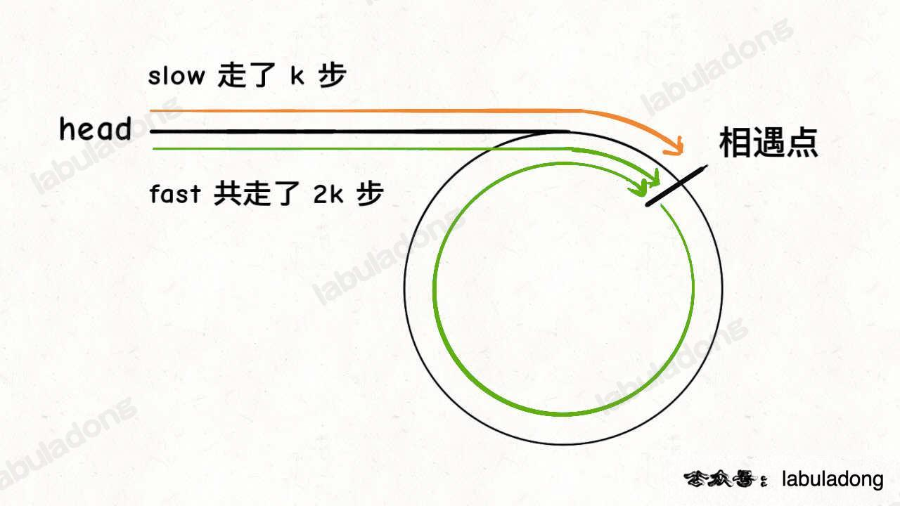
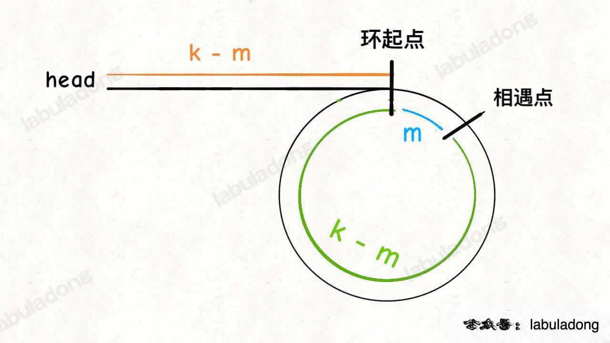

<!--
 * @Auther: zth
 * @Date: 2024-03-04 10:51:47
 * @LastEditTime: 2024-03-04 16:10:55
 * @Description:
-->

> Problem: [142.环形链表 II](https://leetcode.cn/problems/linked-list-cycle-ii)

> 参考博客：[《双指针技巧秒杀七道链表题目》](https://labuladong.online/algo/essential-technique/linked-list-skills-summary/#合并-k-个有序链表)

# 标签

- 算法：#双指针，#快慢指针
- 数据结构：#链表

# 思路

- 第 1 次相遇在**环内**：
  - 假设快慢指针相遇时，`slow` 走了 `k` 步，则 `fast` 一定走了 `2k` 步（因为 `fast` 每次前进 2 步）；
  - `fast` 比 `slow` 多走的 `k` 步，就是 `fast` 在环里转圈圈，所以 `k` 就是环的长度的整数倍；
    
- 第 2 次相遇在**环的起点**：
  - 假设相遇点距环的起点的距离为 `m`，那么环的起点距头结点的距离为 `k - m`，这段让 `slow` 去走；
  - `fast` 从相遇点继续前进 `k - m` 步，恰好到达环起点。
    

# 解题方法

当快慢指针相遇时，让 `slow` 从头结点开始走，`fast` 从相遇点开始走，每次都走一步，再次相遇的点就是环的起点。

# 复杂度

- 时间复杂度：$O(n)$，其中 $n$ 为给定链表的长度。
- 空间复杂度：$O(1)$，只需要常数的空间存放 `slow` 和 `fast` 两个指针。

# 代码

## labuladong

```Java
public class Solution {
    public ListNode detectCycle(ListNode head) {
        ListNode slow = head, fast = head;
        while (fast != null && fast.next != null) {
            slow = slow.next;
            fast = fast.next.next;
            if (slow == fast) {
                // 第 1 次相遇在环内
                break;
            }
        }

        // fast 遇到空指针说明没有环
        if (fast == null || fast.next == null) {
            return null;
        }

        // 重新指向头结
        slow = head;
        // 快慢指针同步前进，第 2 次相交点就是环起点
        while (slow != fast) {
            fast = fast.next;
            slow = slow.next;
        }
        return slow;
    }
}
```
