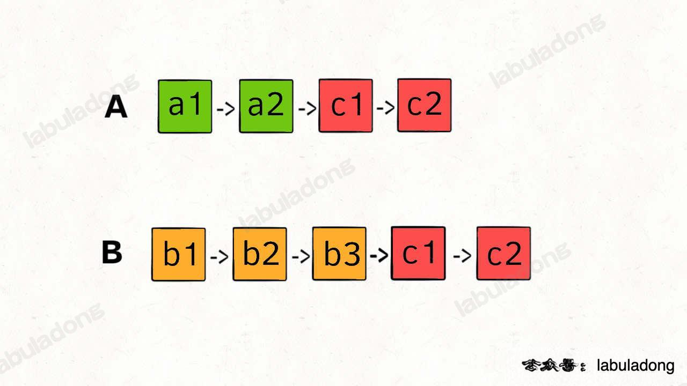

<!--
 * @Auther: zth
 * @Date: 2024-03-04 10:51:47
 * @LastEditTime: 2024-03-04 20:01:48
 * @Description:
-->

> Problem: [160. 相交链表](https://leetcode.cn/problems/intersection-of-two-linked-lists/)

> 参考博客：

# 标签

- 算法：#双指针
- 数据结构：#链表

# 思路

- 两条链表的长度可能不一样，但是如果有交点，那么交点之后的长度一定是一样的；
  

# 解题方法

让 p1 和 p2 分别遍历两条链表，当遍历到链表的尾部时，将 p1 指向 headB，将 p2 指向 headA，这样两个指针就会在交点处相遇。

# 复杂度

- 时间复杂度：$O(m+n)$，m 和 n 分别是两条链表的长度；
- 空间复杂度：$O(1)$

# 代码

## labuladong

```Java
public class Solution {
    public ListNode getIntersectionNode(ListNode headA, ListNode headB) {
        ListNode p1 = headA, p2 = headB;
        while (p1 != p2) {
            if (p1 == null) p1 = headB; // 如果 p1 遍历完了 headA，就指向 headB
            else p1 = p1.next;
            if (p2 == null) p2 = headA; // 如果 p2 遍历完了 headB，就指向 headA
            else p2 = p2.next;
        }
        return p1;
    }
}
```
