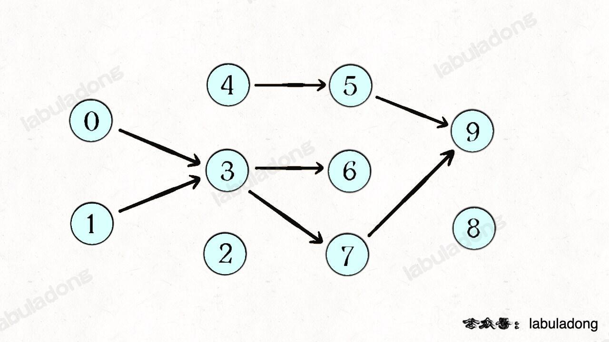

<!--
 * @Auther: zth
 * @Date: 2024-03-04 10:51:47
 * @LastEditTime: 2024-03-13 19:56:13
 * @Description:
-->

> Problem: [207. 课程表](https://leetcode.cn/problems/course-schedule/)

> 参考博客：[环检测及拓扑排序算法](https://labuladong.online/algo/data-structure/topological-sort/)

# 标签

- 算法：#DFS
- 数据结构：#图 #邻接表

# 思路

核心就是判断一幅有向图中是否存在环。

## 建图

根据题目输入的 prerequisites 数组生成一幅类似这样的图，边的方向是「被依赖」关系，即修完课程 from 才能修课程 to：


如果发现这幅有向图中存在环，那就说明课程之间存在**循环依赖**，肯定没办法全部上完；反之，如果没有环，那么肯定能上完全部课程。

## DFS 遍历图

根据 DFS 遍历图的框架

## 判断图中是否有环

类似回溯，把递归函数 `traverse` 看成一个在递归树上游走的指针，只需要再添加一个布尔数组 `onPath` 记录当前 `traverse` 经过的路径：

# 解题方法

# 复杂度

- 时间复杂度：$O(N+M)$，其中 N 表示课程数，M 表示先修课程的要求数。
- 空间复杂度：
  - 题目中是以列表形式给出的先修课程关系，为了对图进行深度优先搜索，我们需要存储成邻接表的形式，空间复杂度为 $O(n+m)$；
  - 在深度优先搜索的过程中，我们需要最多 $O(n)$ 的栈空间（递归）进行深度优先搜索，因此总空间复杂度为 $O(n+m)$。

# 代码

## labuladong

```Java
class Solution {
    boolean[] onPath; // 记录一次递归堆栈中的节点
    boolean[] visited; // 记录遍历过的节点，防止走回头路
    boolean hasCycle = false; // 记录图中是否有环

    public boolean canFinish(int numCourses, int[][] prerequisites) {
        List<Integer>[] graph = buildGraph(numCourses, prerequisites);

        visited = new boolean[numCourses];
        onPath = new boolean[numCourses];

        for (int i = 0; i < numCourses; i++) {
            // 遍历图中所有节点
            traverse(graph, i);
        }

        // 只要没有循环依赖就可以完成所有课程
        return !hasCycle;
    }

    void traverse(List<Integer>[] graph, int s) {
        if (onPath[s]) {
            // 出现环
            hasCycle = true;
        }

        if (visited[s] || hasCycle) {
            // 如果已经找到了环，也不能用再遍历了
            return;
        }

        // 前序位置
        visited[s] = true;
        onPath[s] = true;
        for (int t : graph[s]) {
            traverse(graph, t);
        }

        // 后序位置
        onPath[s] = false;
    }

    // 建图
    /**
     * @param numCourses 课程数
     * @param prerequisites 有向边数组
     * @return 图的邻接表
     */
    List<Integer>[] buildGraph(int numCourses, int[][] prerequisites) {
        // 图中共有 numCourses 个节点
        List<Integer>[] graph = new LinkedList[numCourses];
        for (int i = 0; i < numCourses; i++) {
            graph[i] = new LinkedList<>();
        }
        for (int[] edge : prerequisites) {
            int from = edge[1], to = edge[0];
            // 添加一条从 from 指向 to 的有向边
            // 边的方向是「被依赖」关系，即修完课程 from 才能修课程 to
            graph[from].add(to);
        }
        return graph;
    }
}
```
