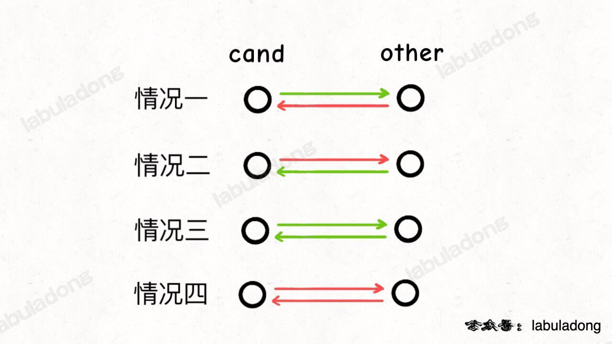

<!--
 * @Auther: zth
 * @Date: 2024-03-04 10:51:47
 * @LastEditTime: 2024-03-11 14:17:17
 * @Description:
-->

> Problem: [277. 搜寻名人](https://leetcode.cn/problems/find-the-celebrity/)

> 参考博客：

# 标签

- 算法：#图
- 数据结构：#图 #邻接矩阵

# 思路

- 「名人」定义：

  1. 所有其他人都认识他；
  2. 他不认识任何其他人。

  - 这个定义保证了人群中最多有一个名人。



- 两个人之间的关系只有 4 种情况：

  1. `cand` 认识 `other`，所以 `cand` 肯定不是名人，排除。因为名人不可能认识别人。
  2. `other` 认识 `cand`，所以 `other` 肯定不是名人，排除。
  3. 他俩互相认识，肯定都不是名人，可以随便排除一个。
  4. 他俩互不认识，肯定都不是名人，可以随便排除一个。因为名人应该被所有其他人认识。

  - 综上，只要观察任意两个之间的关系，就至少能确定一个人不是名人，上述情况判断可以用如下代码表示：

  ```Java
  if (knows(cand, other) || !knows(other, cand)) {
    // cand 不可能是名人
  } else { // 即 knows(other, cand) || !knows(cand, other)
    // other 不可能是名人
  }
  ```

# 解题方法

# 复杂度

- 时间复杂度：$O(n)$
- 空间复杂度：$O(1)$

# 代码

## labuladong

```Java
/* The knows API is defined in the parent class Relation.
      boolean knows(int a, int b); */

public class Solution extends Relation {
    public int findCelebrity(int n) {
        int cand = 0; // 假设 cand 是名人
        for (int other = 1; other < n; other++) {
            // other 不认识 cand 或者 cand 认识 other
            if (!knows(other, cand) || knows(cand, other)) {
                // cand 不可能是名人，排除，并假设 other 是名人
                cand = other;
            }
            else {
                // other 不可能是名人，排除，继续假设 cand 是名人
            }
        }

        // 现在的 cand 是排除的最后结果，但不能保证是名人
        for (int other = 0; other < n; other++) {
            if (cand == other) {
                continue;
            }
            // 如果 other 不认识 cand 或者 cand 认识 other，说明 cand 不是名人
            if (!knows(other, cand) || knows(cand, other)) {
                return -1;
            }
        }

        return cand;
    }
}
```
