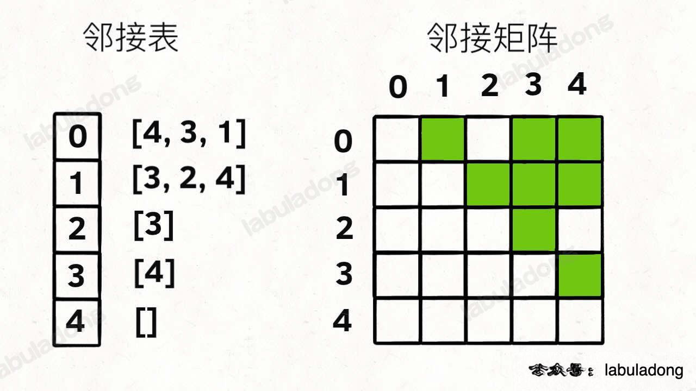
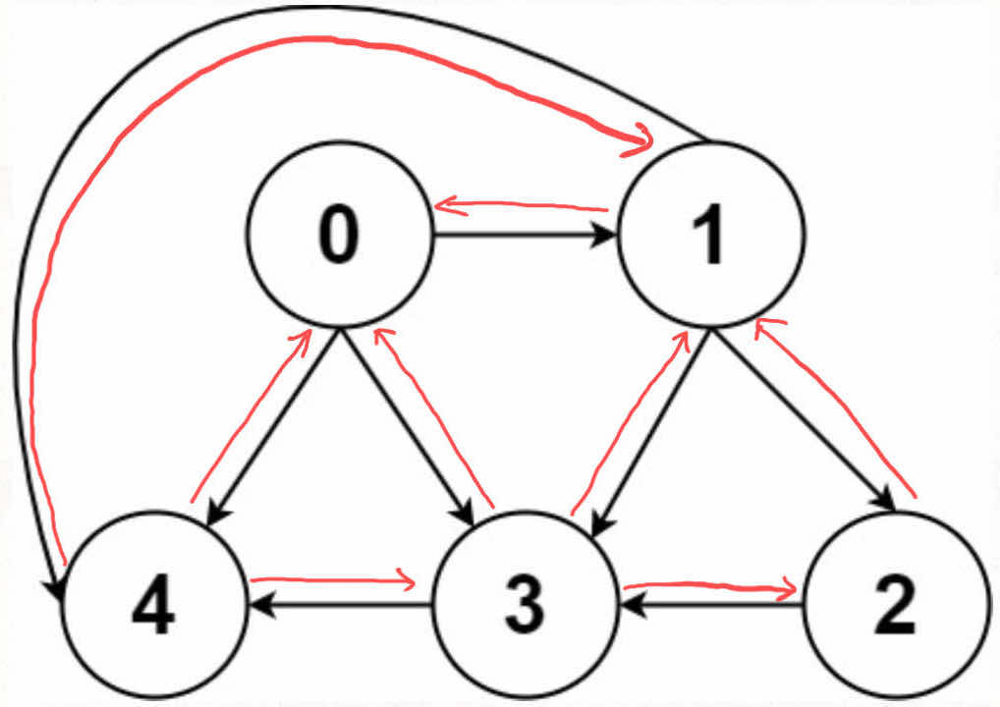

<!--
 * @Auther: zth
 * @Date: 2024-03-11 12:57:49
 * @LastEditTime: 2024-03-11 13:24:00
 * @Description:
-->

> 参考博客：[图论基础及遍历算法](https://labuladong.online/algo/data-structure/graph-traverse/)

# 各种图

- 本质上，图是多叉树的延伸，适用于树的 DFS/BFS 遍历算法全部适用于图。
- 实现图用（常规算法题中，邻接表的使用更频繁，因为操作简单）：
  - 邻接表
    - 优：占用空间少
    - 缺：无法快速判断两个节点是否相邻
  - 邻接矩阵
    

```Java
// 邻接表
// graph[x] 存储 x 的所有邻居节点
List<Integer>[] graph;

// 邻接矩阵
// matrix[x][y] 记录 x 是否有一条指向 y 的边
boolean[][] matrix;
```

- **度**（degree）：

  - 无向图中：「度」是每个节点相连的边的条数；
  - 有向图中：每个节点「度」被细分为**入度**和**出度**。

- 有向加权图：
  - 邻接表：不仅存储每个节点 `x` 的所有邻居节点，还存储 `x` 到每个邻居的权重；
  - 邻接矩阵：`matrix[x][y]` 不再是布尔值，而是一个 `int` 值，0 表示 `x` 到 `y` 之间没有边，非 0 的值表示 `x` 到 `y` 的边的权重。

```Java
// 有向加权图
// 邻接表
// graph[x] 存储 x 的所有邻居节点以及对应的权重
List<int[]>[] graph;

// 邻接矩阵
// matrix[x][y] 记录 x 指向 y 的边的权重，0 表示不相邻
int[][] matrix;
```

- 无向加权图：无向等同于双向
  - 邻接表：在 `x` 的邻居列表里添加 `y`，同时在 `y` 的邻居列表里添加 `x`；
  - 邻接矩阵：`matrix[x][y]` 和 `matrix[y][x]` 都设置为 `true`。



# 图的遍历

图和多叉树最大的区别：图可能包含环，所以在遍历图时，需要使用 `visited` 数组记录已经访问过的节点，防止重复访问。
